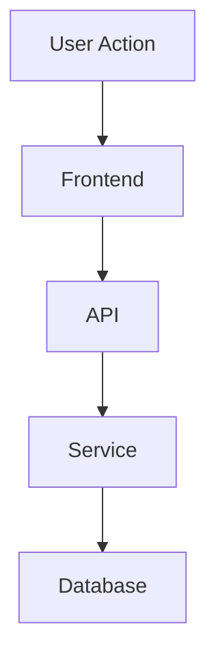

# Project Rules

## `/opsx-explore` Response Format

When responding to `/opsx-explore`, the agent must produce a concise, structured, decision-oriented exploration summary.

The response must include only the following sections, in this exact order:

`[Summary]`:
* Provide 2–4 bullet points only.
* Summarize what was explored, what was found, what matters, and the current state.
* Focus on facts from the explored context.
* Include a simple diagram when it helps explain the flow, dependency, architecture, or decision path.
* Prefer a compact Mermaid diagram using `flowchart TD`.
* Keep diagrams small: maximum 6 nodes unless more are essential.
* Diagram labels must be short and easy to understand.
* Do not include implementation details in the diagram unless they are essential to the finding.
* Do not mention missing information here; put it under `[Questions]` or `[Risk]`.

Example diagram format:

`[Files Checked]`:
* List the main files, modules, services, configs, scripts, tests, or documentation that were reviewed.
* Include a short note for each item explaining why it matters.
* Group related files when helpful.
* If no files were checked, write: `None`.
* Do not include every file if many were checked; include only decision-relevant files.

`[Impact]`:
* Explain the practical impact on the product, codebase, user flow, system behavior, team workflow, or decision.
* Clearly state the impact level when possible: `High`, `Medium`, `Low`, or `Unknown`.
* Mention affected modules, features, files, services, stakeholders, or users when known.
* Keep the explanation decision-oriented and avoid repeating the summary.

`[Questions]`:
* List only open questions that must be answered before implementation, approval, or decision-making.
* Do not include questions that are already answered by the explored context.
* Do not include nice-to-have or low-value questions.
* If there are no important open questions, write: `None`.

`[Risk]`:
* Identify potential risks, edge cases, blockers, or assumptions.
* Separate confirmed risks from assumptions when both exist.
* Include technical, UX, business, security, performance, data, dependency, rollout, or maintenance risks when relevant.
* Clearly label assumptions as `Assumption:`.
* If no meaningful risks are found, write: `No major risk identified`.

`[Recommendation]`:
* Provide a clear next-step recommendation based on the exploration.
* Use one of the following decision labels when possible: `Proceed`, `Proceed with caution`, `Needs clarification`, `Do not proceed`, or `No action needed`.
* Keep it to 1–3 bullet points.
* Do not include a full implementation plan unless explicitly requested.
* If the context is insufficient to recommend a direction, write: `Needs clarification`.

`[Recommended Spec Name]`:
* If `[Questions]` is `None`, recommend one clear spec name for the next implementation/specification step.
* The name must be short, descriptive, and implementation-ready.
* Prefer kebab-case.
* Use a format like: `spec-[feature-or-module]-[change-or-goal]`.
* Example: `spec-user-auth-session-refresh`.
* If `[Questions]` contains open questions, write: `Pending questions`.

General rules:
* Use bullets, not long paragraphs.
* Be concise and avoid repeating the same idea across sections.
* Do not include a full implementation plan unless explicitly requested.
* Do not provide code unless it is necessary to explain a finding.
* Mermaid diagrams are allowed only inside `[Summary]`.
* Do not add extra sections beyond the required sections above.
* Do not include greetings, prefaces, conclusions, or meta commentary.
* Clearly distinguish confirmed facts from assumptions.
* If information is missing or uncertain, mention it under `[Questions]` or `[Risk]`, not `[Summary]`.
* If the explored context is insufficient, state the missing decision-critical information under `[Questions]`.
* Only recommend a spec name when there are no important open questions.

## Frontend UI Development Rule

* **Ant Design + Design Taste Integration**: When building or refactoring frontend source code (UI components, layouts, pages), ALWAYS use **Ant Design (`antd`)** as the primary component library and combine it with **Design Taste** principles (`design-taste-frontend` / `design-taste-frontend-v1`).
* **Component Usage**: Use Ant Design components (`Form`, `Input`, `Button`, `Card`, `Typography`, `Flex`, `Row`, `Col`, `Badge`, `Tag`, etc.) and official `@ant-design/icons` for core interactive elements and layouts.
* **Design & Aesthetics**: Customize Ant Design's `ConfigProvider` themes, typography, spacing, and colors to deliver anti-slop, high-end visual aesthetics (e.g. customized dark/light algorithms, glassmorphism paneling, clear visual hierarchy, and perpetual micro-interactions where appropriate).

## Task Completion & Verification Rule

* **Zero Error Mandate**: Before declaring any task completed or finished, ALWAYS verify that the codebase contains no remaining errors (such as TypeScript compilation errors, ESLint/linter errors, build failures, or broken tests).
* **Pre-completion Checking**: Run relevant verification commands (e.g., `tsc --noEmit`, `npm run lint`, `npm run build`, `npm test` or module-specific checks) before completing a task.
* **Iterative Fixes**: If any error or warning is reported, fix the root cause and re-verify iteratively until all errors are completely resolved and zero errors remain.

